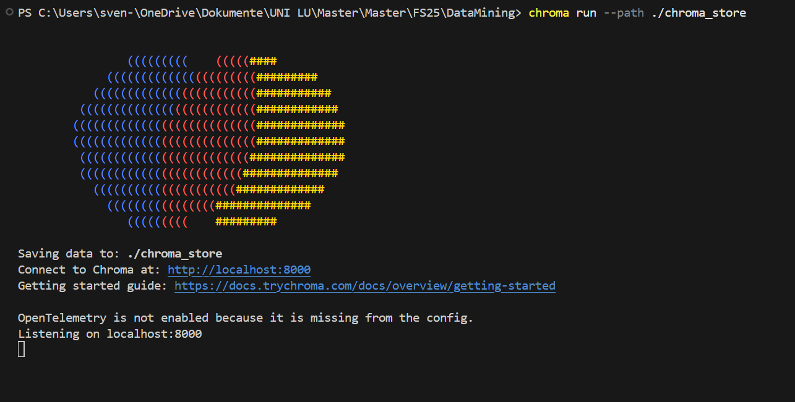

# 🧠 AI-Powered Academic Assistant

This project is an AI-powered research assistant that helps users **search, analyze, and extract structured information** from academic papers. It supports **semantic search** over chunked ArXiv abstracts and lets you extract:

- ✅ Independent & Dependent Variables
- ✅ Paper Summaries

All via OpenAI's GPT models and a **fully local ChromaDB vector store**.

---

## 🚀 Features

- 🔎 Ingest papers from [ArXiv](https://arxiv.org/)
- ✂️ Chunk text using sliding windows
- 🧠 Embed with `sentence-transformers`
- 💾 Store/retrieve via **ChromaDB 1.0+** (persistent, local)
- 💬 Ask GPT to extract variables or generate summaries
- 🖥️ Interactive UI with **Streamlit**
- 🎛️ Adjustable filters (category, chunk count, task type)
- 📦 Local vector storage in `chroma_store/`

---

## 🔧 Setup Instructions

### 1. Clone & create a virtual environment

```bash
git clone https://github.com/Svenregli/DataMining
cd DataMining
python -m venv .venv
.\.venv\Scripts\activate
pip install -r requirements.txt


###Add yourOpenAI API key
OPENAI_API_KEY=sk-xxxxxxxxxxxxxxxxxxxxxxxxxxxxxxxx


### 3. run ChromaDB in a seperate Terminal
chroma run --path ./chroma_store
It should look like this: 


### 4. fetch the papers from Arxiv: 
python fetch_arxiv.py          # Download abstracts (category is editable)
python chunk_and_embed.py      # Create semantic chunks & store in Chroma


### Launch the UI
streamlit run app.py
Your browser will open at http://localhost:8501